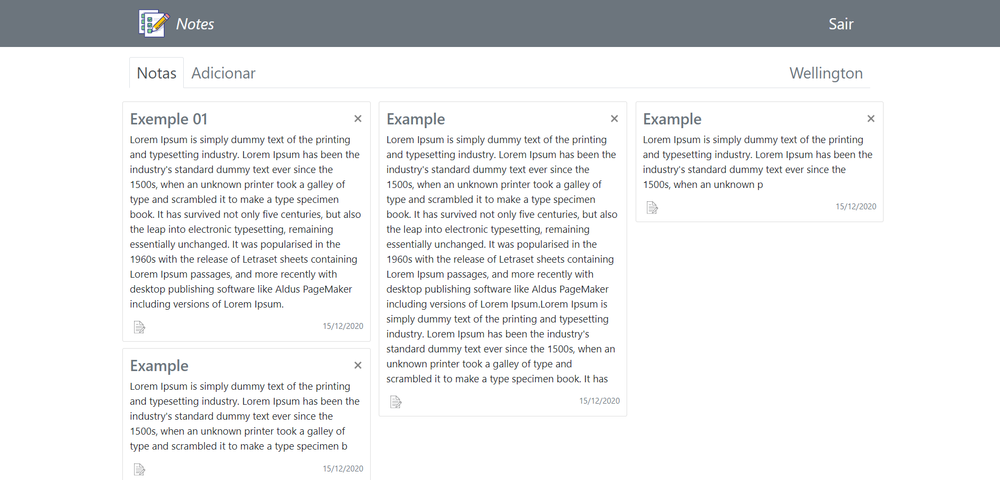

# Notes-App

## Welcome
  
This app basically consists of creating, editing and deleting notes. Everything is saved in a mysql database, including the sessions data.  
If you want to test, just download the files, use the sql file to create the database and install the node modules with yarn or npm.

## Technologies used
- HTML
- CSS (Bootstrap mostly)
- Javascript
- MySQL
